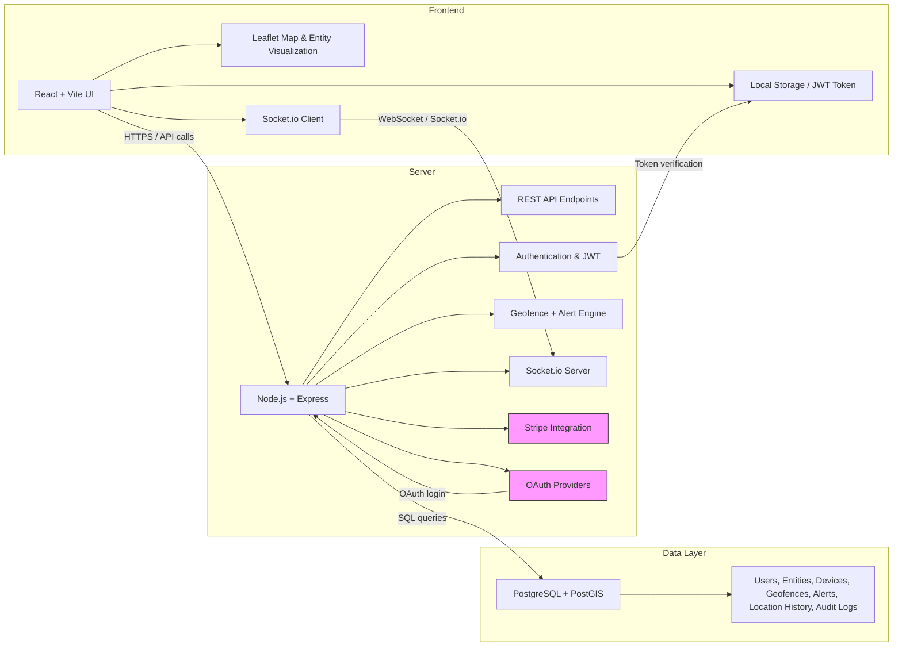

# TrackChip System Architecture Diagram


```mermaid
flowchart LR
  subgraph Client[Frontend]
    A[React + Vite UI]
    B[Leaflet Map & Entity Visualization]
    C[Socket.io Client]
    D[Local Storage / JWT Token]
    A --> B
    A --> C
    A --> D
  end

  subgraph Backend[Server]
    E[Node.js + Express]
    F[REST API Endpoints]
    G[Authentication & JWT]
    H[Geofence + Alert Engine]
    I[Socket.io Server]
    J[Stripe Integration]
    K[OAuth Providers]
    E --> F
    E --> G
    E --> H
    E --> I
    E --> J
    E --> K
  end

  subgraph Database[Data Layer]
    L[PostgreSQL + PostGIS]
    M[Users, Entities, Devices, Geofences, Alerts, Location History, Audit Logs]
    L --> M
  end

  A -->|HTTPS / API calls| E
  C -->|WebSocket / Socket.io| I
  E -->|SQL queries| L
  G -->|Token verification| D
  K -->|OAuth login| E

  classDef external fill:#f9f,stroke:#333,stroke-width:1px;
  class K,J external;
```
```
